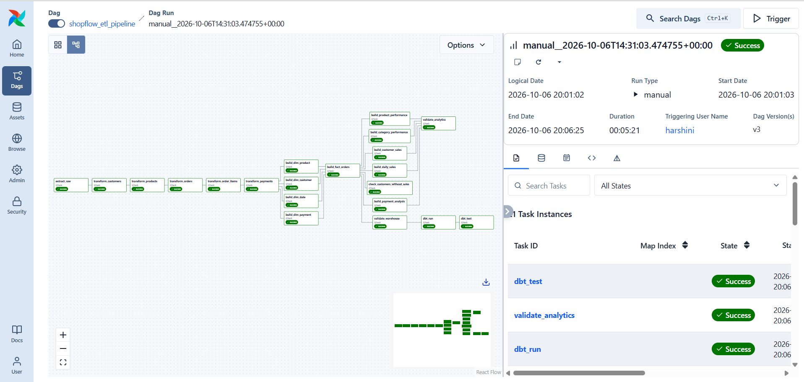
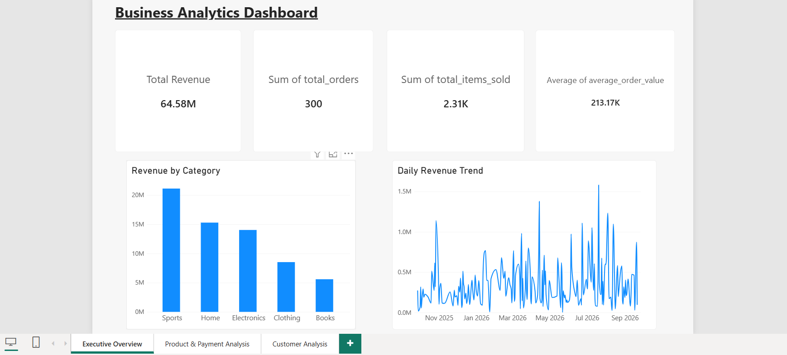
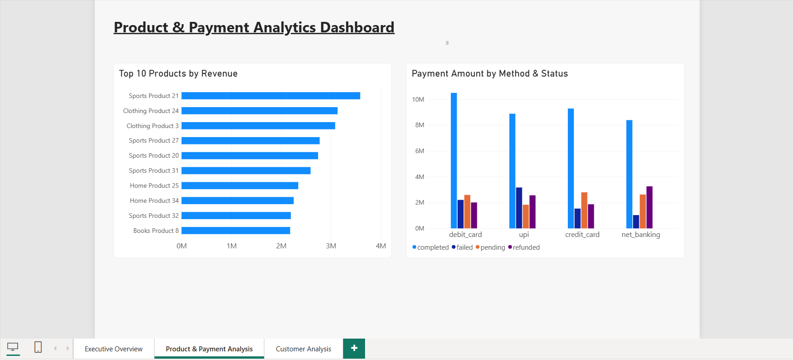
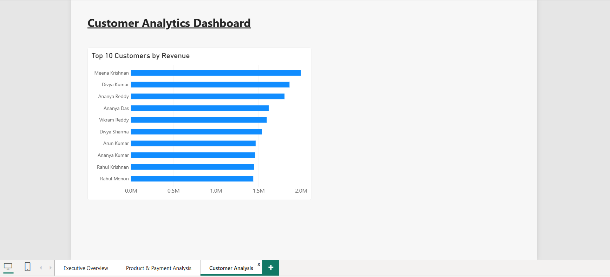

# ShopFlow Data Platform

An end-to-end e-commerce data engineering platform built with PostgreSQL, Apache Airflow, PySpark, Parquet, dbt, and Power BI.

## Architecture

```text
PostgreSQL
    ↓
Apache Airflow
    ↓
PySpark ETL
    ↓
Parquet Warehouse
    ↓
dbt Analytics Marts
    ↓
Power BI
````

## Overview

ShopFlow simulates a production-style e-commerce data platform for customers, products, orders, order items, and payments.

The platform demonstrates:

* Batch and incremental data ingestion
* PySpark ETL and warehouse construction
* Dimensional data modeling
* Slowly Changing Dimension Type 2 (SCD2)
* Parquet-based analytical storage
* Apache Airflow orchestration
* dbt analytics modeling and testing
* Power BI dashboards
* Data-quality and pipeline validation

## Data Warehouse

### Dimensions

* `dim_customer`
* `dim_product`
* `dim_payment`
* `dim_date`

### Fact

* `fact_orders`

`dim_customer` uses **Slowly Changing Dimension Type 2** to preserve historical customer records.

## Pipeline

```text
PostgreSQL
    ↓
Incremental Extraction
    ↓
PySpark Transformations
    ↓
Dimension & Fact Construction
    ↓
Parquet Warehouse
    ↓
dbt Staging & Analytics
    ↓
Power BI
```

Apache Airflow orchestrates the complete workflow, including extraction, transformation, warehouse construction, validation, dbt execution, and testing.

Main DAG:

```text
airflow/dags/shopflow_etl.py
```

## dbt Analytics Layer

The dbt project contains **17 models** and **47 automated tests**.

### Official Analytics Marts

* `mart_customer_performance`
* `mart_daily_sales`
* `mart_product_performance`
* `mart_category_performance`
* `mart_payment_analysis`

These marts form the official reporting layer consumed by Power BI.

### Data Quality

Automated validation covers:

* Uniqueness
* Not-null constraints
* Referential integrity
* Accepted values
* Revenue calculations
* Quantity validation
* Revenue validation
* SCD2 data integrity

**Validation result: 47/47 dbt tests passed.**

## Power BI

The project includes a three-page business intelligence dashboard.

### Business Analytics

* Total Revenue
* Total Orders
* Units Sold
* Average Order Value
* Revenue by Category
* Daily Revenue Trend

### Product & Payment Analytics

* Top 10 Products by Revenue
* Payment Amount by Method
* Payment Status Analysis

### Customer Analytics

* Top 10 Customers by Revenue
* Customer Performance

## Technology Stack

| Technology     | Purpose                          |
| -------------- | -------------------------------- |
| Python         | Ingestion and pipeline utilities |
| PostgreSQL     | Source database                  |
| PySpark        | ETL and warehouse construction   |
| Apache Airflow | Workflow orchestration           |
| Parquet        | Analytical storage               |
| DuckDB         | dbt analytical engine            |
| dbt            | Analytics modeling and testing   |
| Power BI       | Business intelligence            |
| Docker         | Containerization                 |
| Git/GitHub     | Version control                  |

## Project Structure

```text
shopflow-data-platform/
│
├── airflow/
│   ├── dags/
│   │   └── shopflow_etl.py
│   ├── Dockerfile
│   └── docker-compose.yaml
│
├── dbt_shopflow/
│   ├── models/
│   │   ├── staging/
│   │   └── warehouse/
│   ├── tests/
│   └── dbt_project.yml
│
├── ingestion/
│   ├── extract_raw.py
│   ├── extract_incremental.py
│   ├── update_watermark.py
│   └── generate_data.py
│
├── spark/
│   ├── transform_*.py
│   ├── build_dim_*.py
│   ├── build_fact_orders.py
│   ├── update_dim_customer_scd2.py
│   └── validate_*.py
│
├── sql/
├── tests/
├── .env.example
├── .gitignore
├── docker-compose.yml
└── README.md
```

## Running the Project

Configure the environment using `.env.example`, then start the Airflow environment:

```bash
docker compose -f airflow/docker-compose.yaml up --build -d
```

Trigger the `shopflow_etl` DAG from the Airflow UI.

To run dbt independently:

```bash
cd dbt_shopflow
dbt run
dbt test
```

## Validation

The completed pipeline has been validated across:

* PostgreSQL ingestion
* Incremental extraction
* PySpark transformations
* Dimensional warehouse construction
* Customer SCD2 processing
* Parquet storage
* Airflow orchestration
* dbt models and tests
* Warehouse validation
* Analytics validation
* Power BI dashboards

## Future Enhancements

* Cloud deployment
* CI/CD integration
* Pipeline monitoring and alerting
* Data lineage
* Additional analytics
* Production-scale infrastructure

## Pipeline Orchestration

The complete ShopFlow data pipeline is orchestrated using Apache Airflow.



The DAG coordinates the pipeline from PostgreSQL ingestion through PySpark transformations, warehouse construction, validation, dbt analytics, and final analytics validation.

### Workflow

```text
PostgreSQL
    ↓
Extract Raw Data
    ↓
PySpark Transformations
    ↓
Build Dimensions
    ↓
Build Fact Table
    ↓
Warehouse Validation
    ↓
dbt Run
    ↓
dbt Test
    ↓
Analytics Validation
```

### Power BI Dashboard

The final dbt analytics marts are connected to Power BI to provide an interactive business analytics dashboard for the ShopFlow Data Platform.

### Business Analytics



Provides an overview of:
- Total revenue
- Total orders
- Units sold
- Average order value
- Revenue by category
- Daily revenue trends

### Product & Payment Analytics



Provides insights into:
- Top 10 products by revenue
- Payment amount by payment method
- Payment status analysis

### Customer Analytics



Provides insights into:
- Top 10 customers by revenue
- Customer-level sales performance

The dashboards are powered by the five official dbt analytics marts:
`mart_daily_sales`, `mart_product_performance`, `mart_category_performance`, `mart_customer_performance`, and `mart_payment_analysis`.